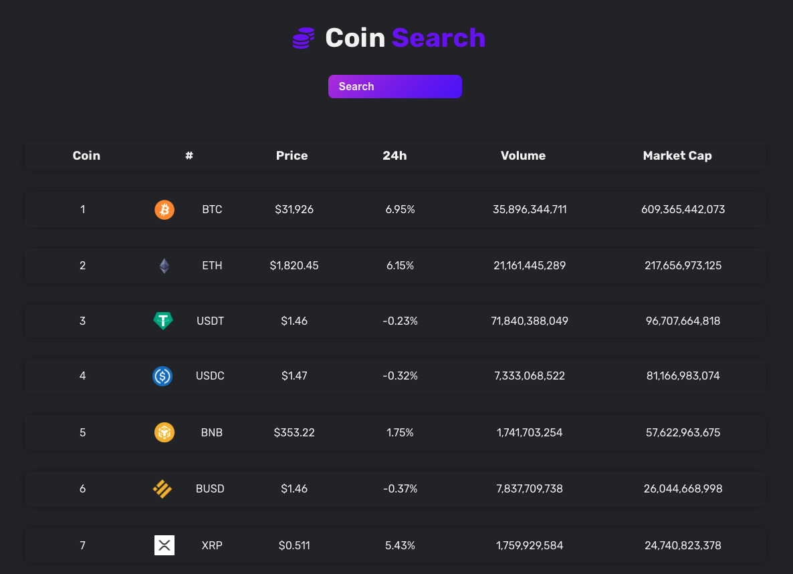

<h1>Coins Search</h1>

Live demo: https://glittery-praline-aa7466.netlify.app

This application uses an external api from Coingecko to show relevant cryptocurrency data that is included: 
<ul>
 <li>Show a range of different cryptocurrencies</li>
 <li>Search specific cryptocurrency by its name</li>
 <li>Display specific cryptocurrency's detail</li>
 <li>Click to display more cryptocurrencies</li>
</ul>

<h1>Screenshot</h1>

 
 

<h1>Technologies</h1>
<ul>
  <li>React Hooks</li>
  <li>Netlify</li>
</ul>
