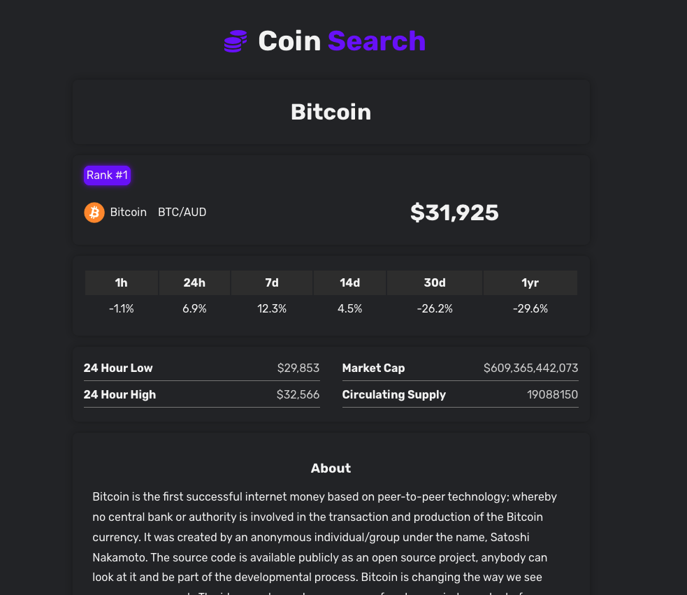

# Coin Search

Live demo: https://glittery-praline-aa7466.netlify.app

This reponsive application uses an external api from Coingecko to show relevant cryptocurrency data that is included:

- Show a range of different cryptocurrencies
- Search specific cryptocurrency by its name
- Display specific cryptocurrency's detail
- Click to display more cryptocurrencies

# Screenshot

# Technologies

- React Hooks
- React Context
- React Router v6
- Axios
- SCSS
- Lodash
- External API
- Netlify
